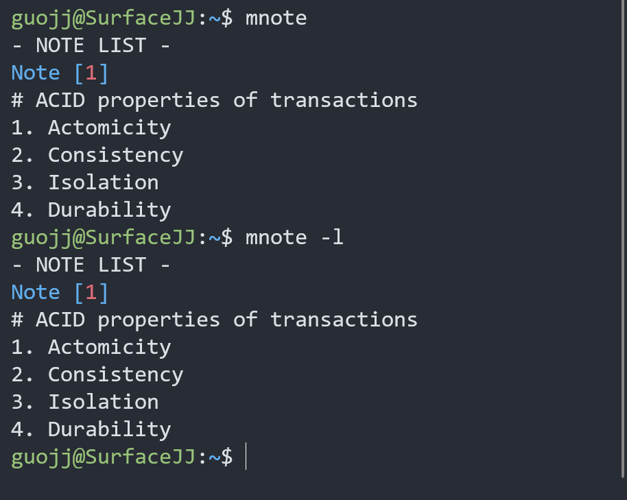
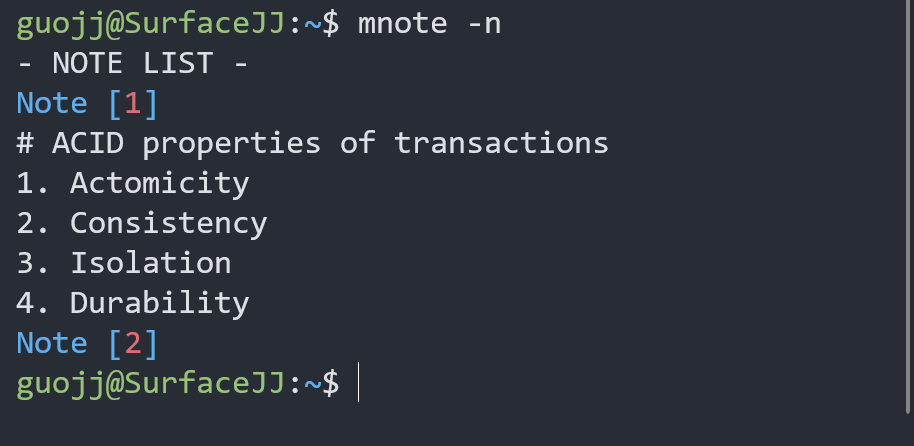

# mnote - a sticky note CLI

## Test Environment
Ubuntu-18.04

## Install
```bash
cd mnote
sudo make install
```

## Uninstall
```bash
cd mnote
sudo make uninstall
```

## Usage

### 1. list all notes

Use`mnote`or`mnote -l`, where `l` stands for `list`.



### 2. create one new note

Use`mnote -n`, where `n`stands for `new`.

Each note will be assigned with an `index`, which would be used in other commands. Note that `index` is not the real file name of the note.



Each note corresponds to a file in directory `~/.mnote/`, with a `md` extension.

```c
/* part of src/mnote.h */
const char programDir[] = ".mnote";
const char configFile[] = ".config";
const char noteExtension[] = ".md";
char *fullProgramDir; //  ~/.mnote
char *fullConfigFile; //  ~/.mnote/.config
```

### 3. open specific note with Vim

Use`mnote -v (index)`, where `v` stands for `Vim`.


### 4. delete specific note

Use`mnote -d (index)`, where `d` stands for `delete`.

